# 测试结果

## 第1关：基本测试

根据S-AES算法编写和调试程序，提供GUI解密支持用户交互。输入可以是8bit的数据和10bit的密钥，输出是8bit的密文。

**加密算法测试结果如下：**

| **明文**                 |         **密钥**         |         **密文**         |
| ------------------------ | :----------------------: | :----------------------: |
| 0000000000000000 -- 0000 | 0000000000000001 -- 0001 | 0001111000001010 -- 1E0A |
| 1111111111111111 -- FFFF | 0000000000000001 -- 0001 | 0011110010001111 -- 3C8F |
| 0000000110101011 -- 01AB | 0000000000000001 -- 0001 | 1000100100101110 -- 892E |
| 0000000000000000 -- 0000 | 1111111111111111 -- FFFF | 0000100011000001 -- 08C1 |
| 1111111111111111 -- FFFF | 1111111111111111 -- FFFF | 0101001101000011 -- 5343 |

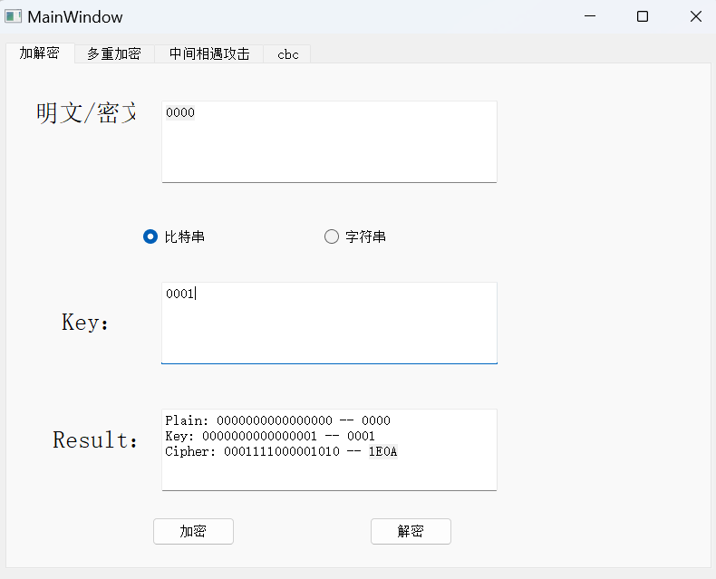

**解密算法测试结果如下：**

|         **密文**         |         **密钥**         |         **明文**         |
| :----------------------: | :----------------------: | :----------------------: |
| 0001111000001010 -- 1E0A | 0000000000000001 -- 0001 | 0000000000000000 -- 0000 |
| 0011110010001111 -- 3C8F | 0000000000000001 -- 0001 | 1111111111111111 -- FFFF |
| 1000100100101110 -- 892E | 0000000000000001 -- 0001 | 0000000110101011 -- 01AB |
| 0000100011000001 -- 08C1 | 1111111111111111 -- FFFF | 0000000000000000 -- 0000 |
| 0101001101000011 -- 5343 | 1111111111111111 -- FFFF | 1111111111111111 -- FFFF |

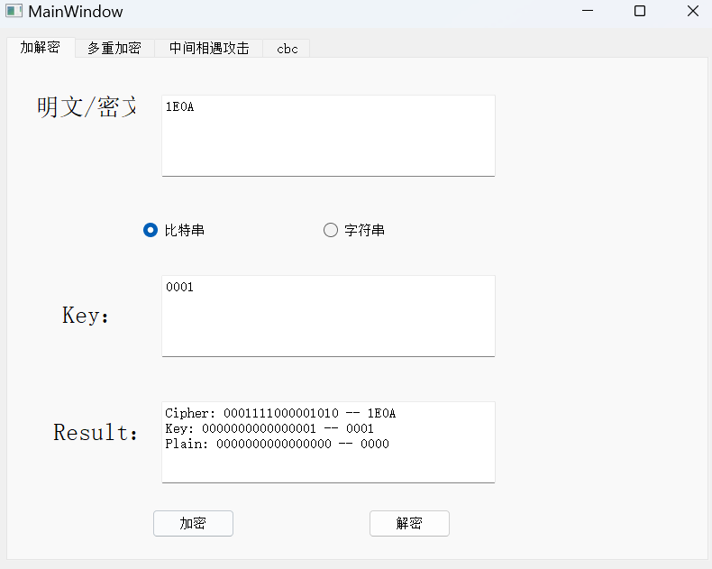

## 第2关：交叉测试

考虑到是**算法标准**，所有人在编写程序的时候需要使用相同算法流程和转换单元(P-Box、S-Box等)，以保证算法和程序在异构的系统或平台上都可以正常运行。

设有A和B两组位同学(选择相同的密钥K)；则A、B组同学编写的程序对明文P进行加密得到相同的密文C；或者B组同学接收到A组程序加密的密文C，使用B组程序进行解密可得到与A相同的P。

* A组(我们组)加密结果

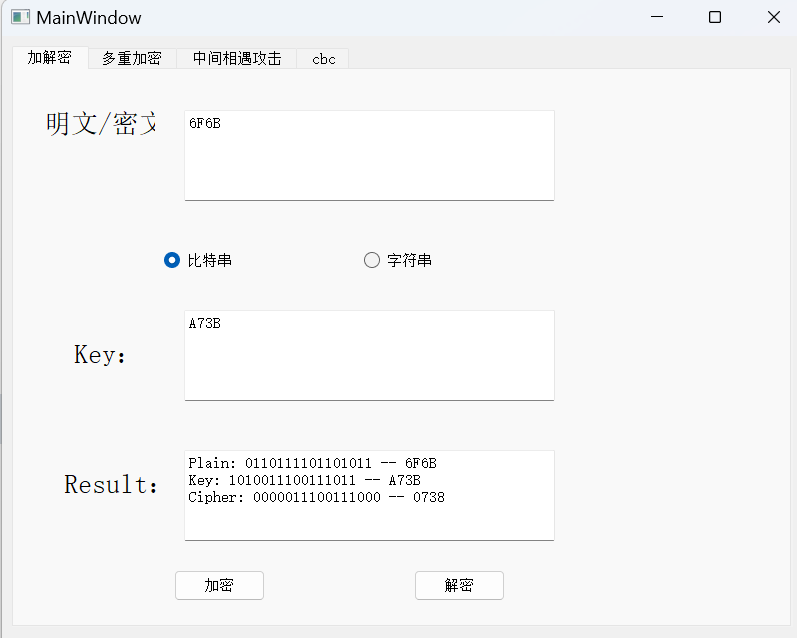

* B组加密结果：

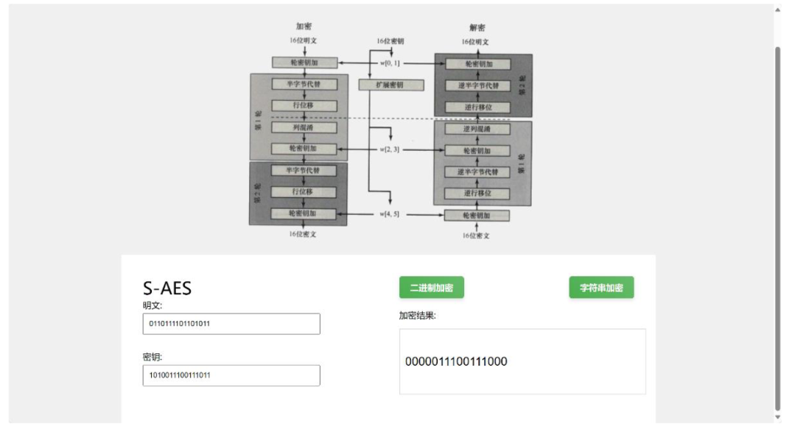

* 两组加密结果相同

## 第3关：扩展功能

考虑到向实用性扩展，加密算法的数据输入可以是ASII编码字符串(分组为2 Byte)，对应地输出也可以是ACII字符串(很可能是乱码)。

加密和解密字符串 **"bb"**，结果如下：

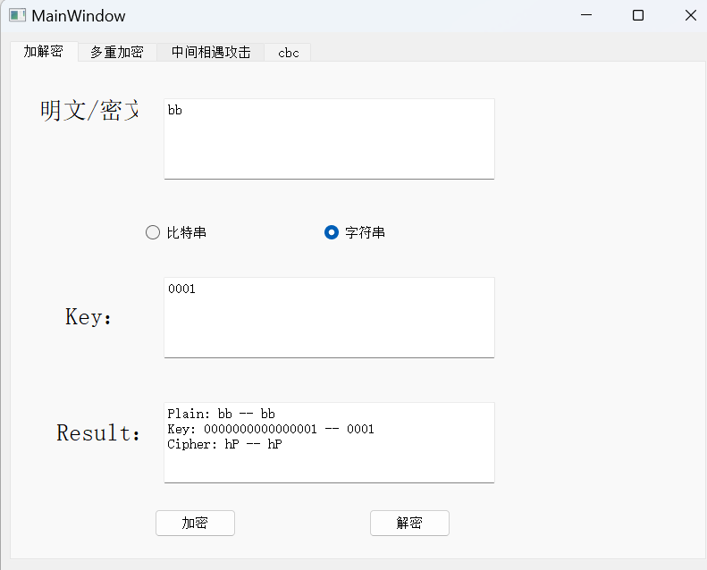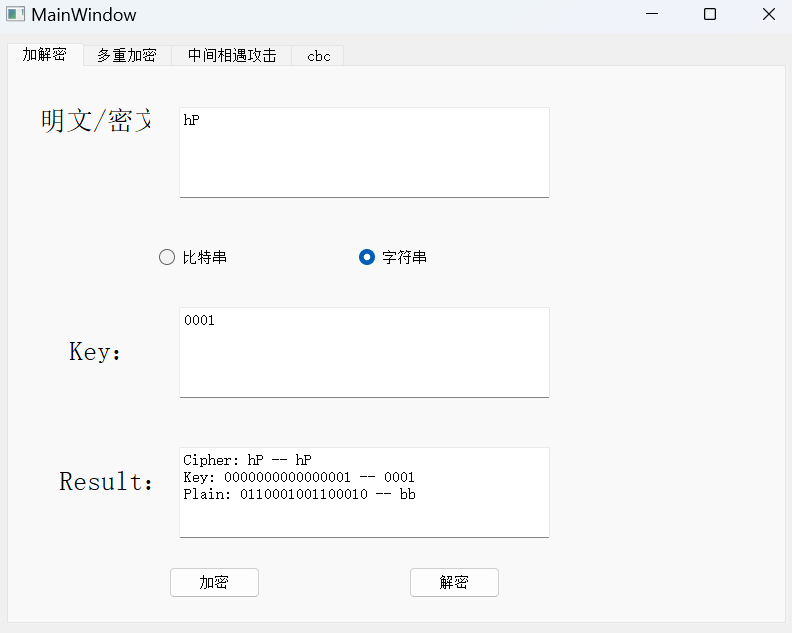

## 第4关：多重加密

* **keyOrder 表示 多把密钥的使用顺序**
  * 0 -- 第 0 把密钥
  * 1 -- 第 1 把密钥
* **strategy 表示 多重加密的加密模式**
  * 0 -- 加密
  * 1 -- 解密
* eg： 
  * keyOrder = “010”
  * strategy = “001”
  * 表示三重加密
    * 第一次使用 **密钥0加密**
    * 第二次使用 **密钥1加密**
    * 第三次使用 **密钥0解密**

## 4.1 双重加密

将S-AES算法通过双重加密进行扩展，分组长度仍然是16 bits，但密钥长度为32 bits。

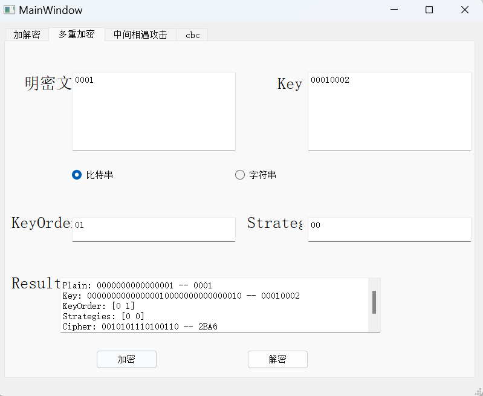

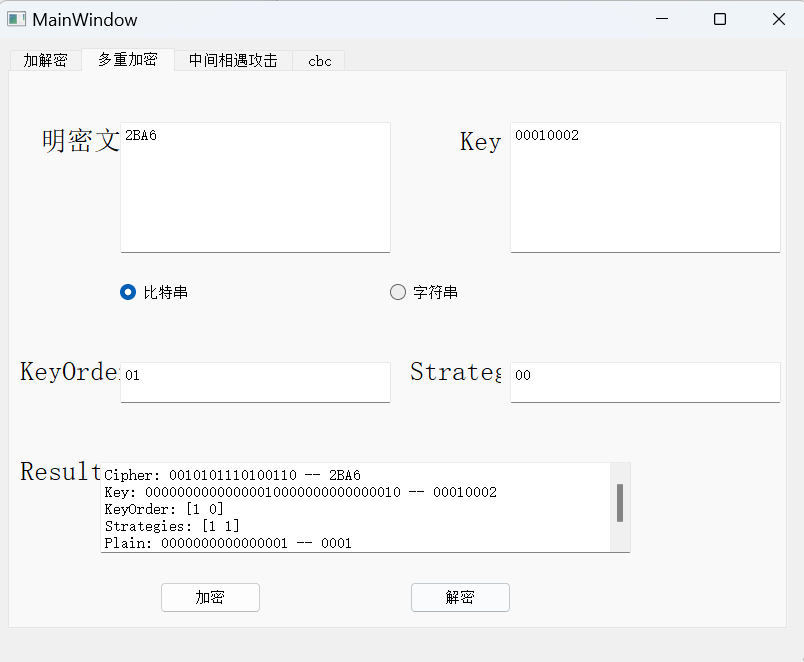

## 4.2 中间相遇攻击

假设你找到了使用相同密钥的明、密文对(一个或多个)，请尝试使用中间相遇攻击的方法找到正确的密钥Key(K1+K2)。

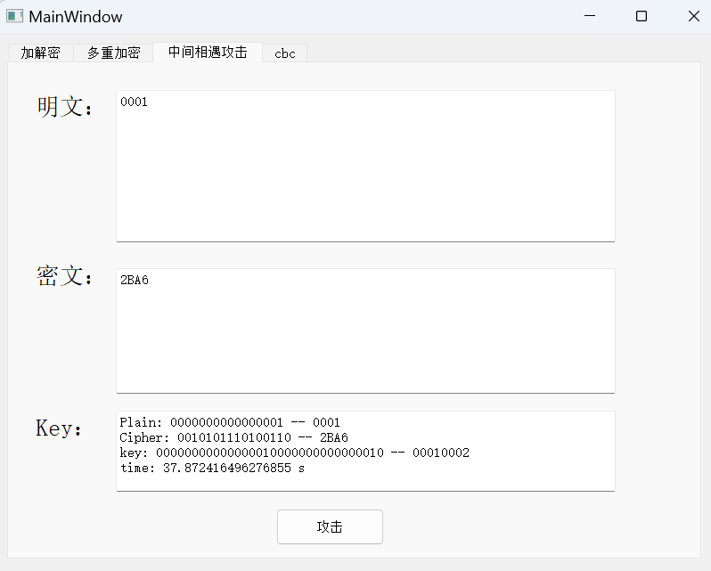

## 4.3 三重加密

### 4.3.1 

按照32 bits密钥Key(K1+K2)的模式进行三重加密解密

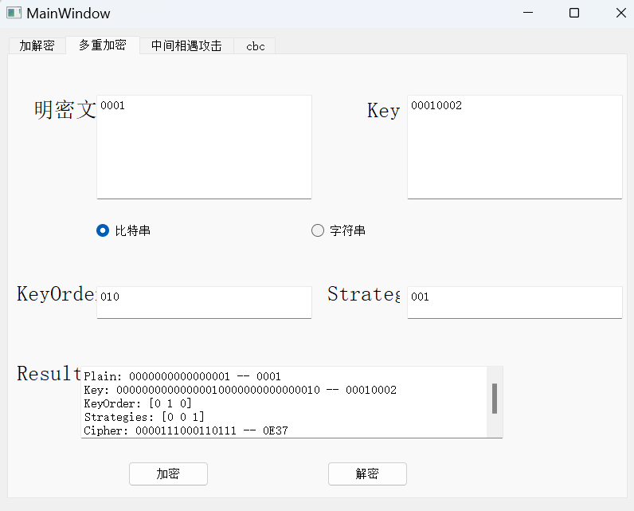

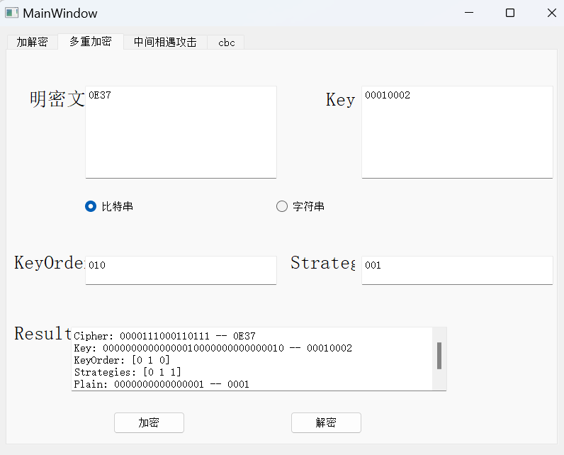

### 4.3.2

使用48bits(K1+K2+K3)的模式进行三重加解密。

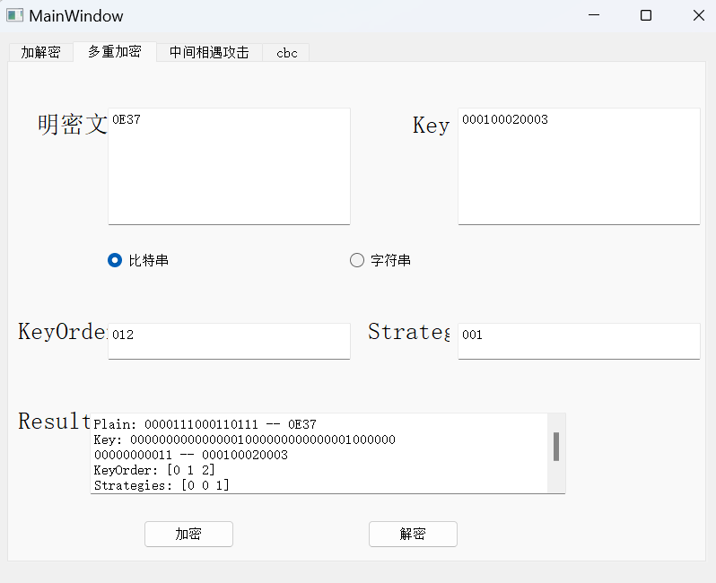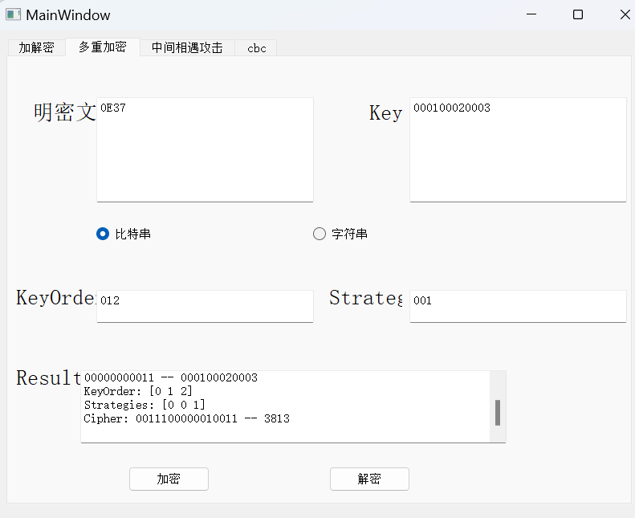

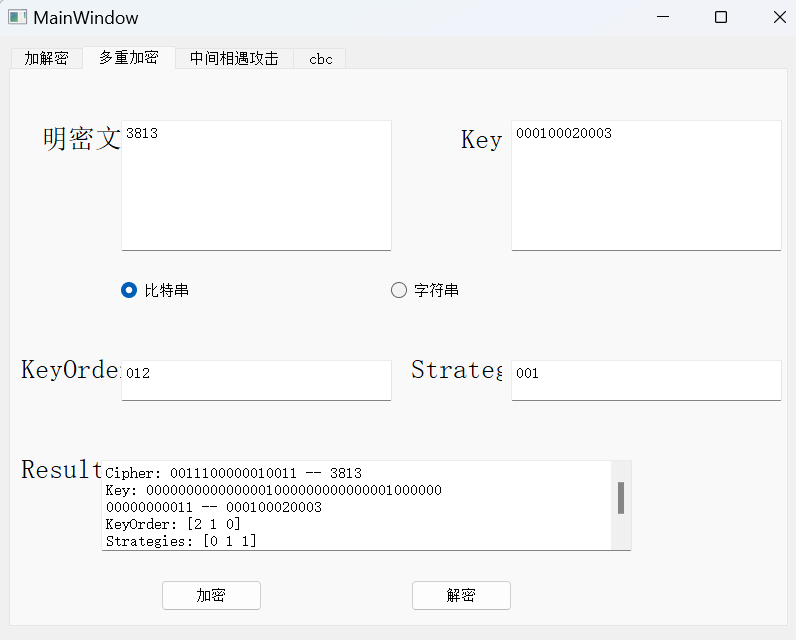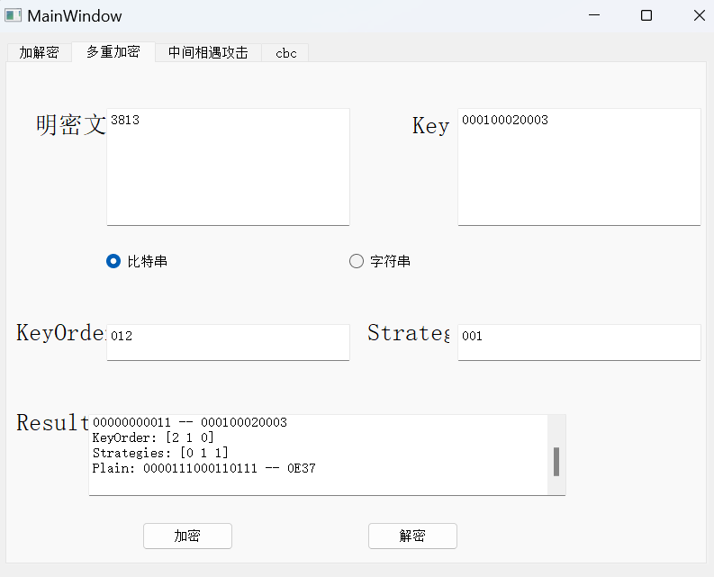

## 第5关：**工作模式**

## 5.1 CBC加解密

基于S-AES算法，使用密码分组链(CBC)模式对较长的明文消息进行加密。注意初始向量(16 bits) 的生成，并需要加解密双方共享。

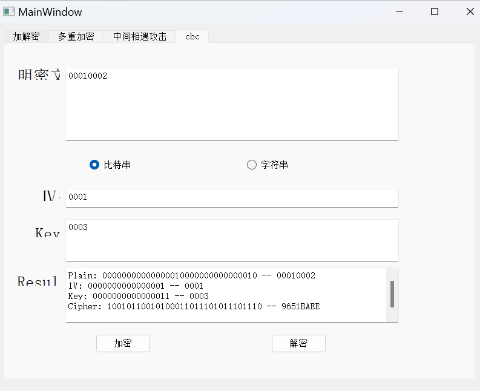

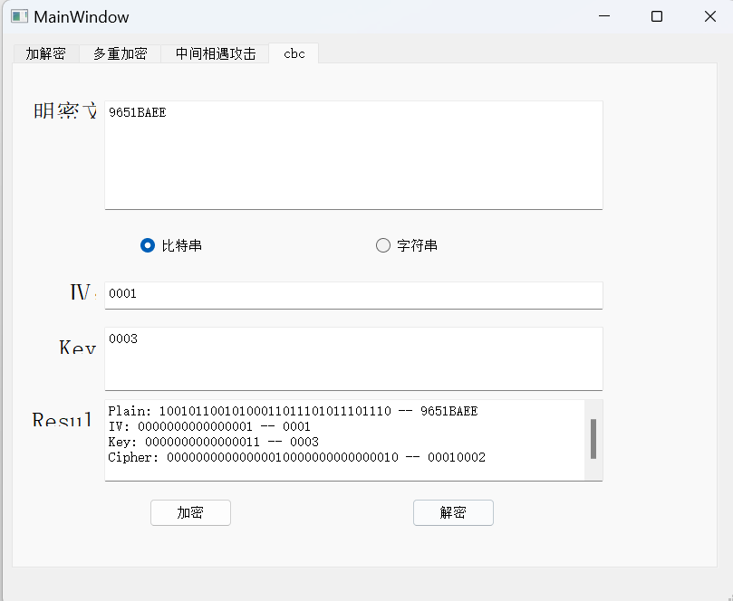

## 5.2 分组修改

在CBC模式下进行加密，并尝试对密文分组进行替换或修改，然后进行解密，请对比篡改密文前后的解密结果。

* 以 16bit 为一个分组
  * 篡改后续分组，不会影响前面的分组解密结果
  * 篡改本分组， 该分组的解密结果可能会混乱

**未修改**

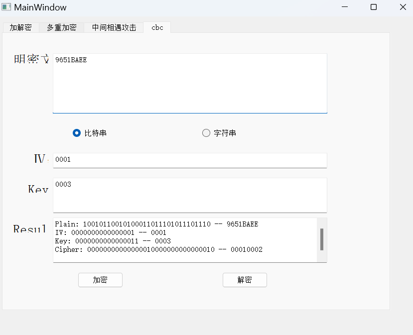

修改第0分组

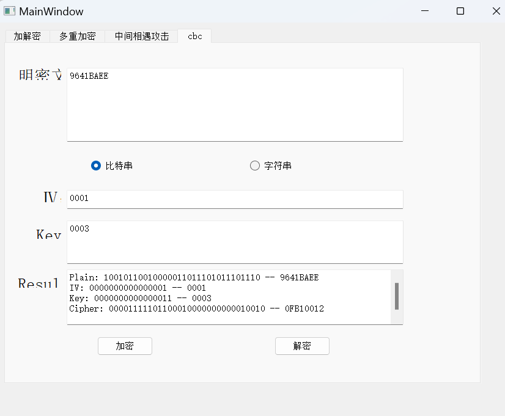

修改第1分组

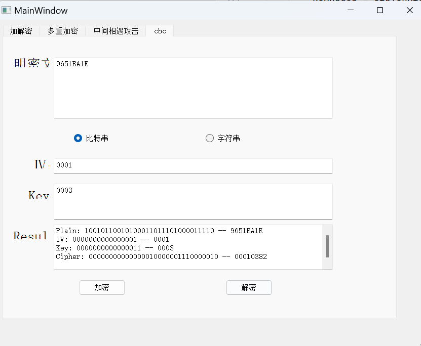
